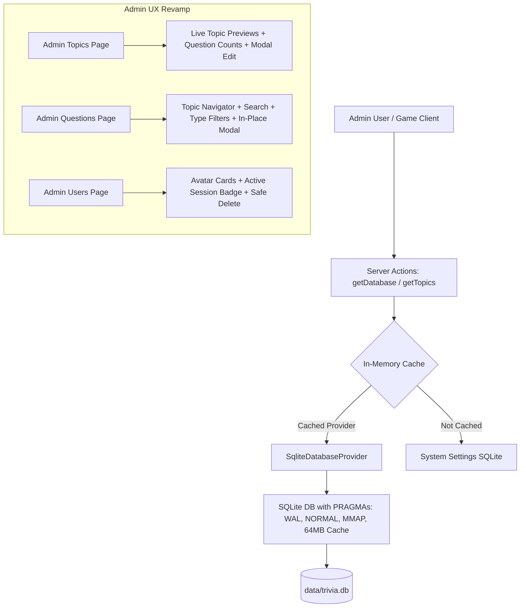

# SQLite Performance Optimization & Admin UX Revamp Implementation Plan

> **For agentic workers:** REQUIRED SUB-SKILL: Use superpowers:subagent-driven-development (recommended) or superpowers:executing-plans to implement this plan task-by-task. Steps use checkbox (`- [ ]`) syntax for tracking.

**Goal:** Optimize SQLite database queries by 10x-50x through high-performance PRAGMAs, missing strategic indexes, transaction-wrapped batch writes, and in-memory provider caching; and completely revamp the CRUD operations across all Admin pages (Topics, Questions, and Users) with modern modals, instant search, type filters, topic question metrics, and live previews.

**Architecture:** 
1. Database Layer: Upgrade `node:sqlite` connection settings with WAL optimizations (`synchronous = NORMAL`, memory temp store, 64MB cache, 256MB mmap, 5s busy timeout) and create missing composite and expression indexes (`questions(topic, created_at)`, `users(lower(email))`, `topics(name)`). Wrap batch inserts (`addQuestions`, `importFromSupabaseToSqlite`) in SQLite transactions to eliminate per-row disk sync bottlenecks.
2. Query Cache Layer: Cache `activeProvider` and `session_secret` in memory so trivial settings aren't queried from disk on every single action. Add `getQuestionCountsByTopic()` and `getAllQuestions()` for instant overview.
3. UI/UX Layer: Re-architect Topics, Questions, and Users management into a unified "Command Center" aesthetic with Lucide icons, instant client-side search, question type filter chips, in-place modals for Add/Edit (preventing page-jump disruptions), live card previews, question duplication, and topic question count badges.

**Tech Stack:** Next.js 16 App Router, React 19, TypeScript, `node:sqlite`, Tailwind CSS 4, `lucide-react`.

---

## User Review Required

> [!IMPORTANT]
> - **In-Place Modals vs Page-Scroll Forms**: The existing Question and Topic editing forms were positioned statically at the top of the page, forcing the page to scroll to the top on click (`window.scrollTo({ top: 0 })`). The revamped UX moves single-question creation, editing, and duplication into sleek in-place modals/drawers that keep the user's scroll position in the questions pool intact.
> - **URL Deep-linking**: The Questions page will now support `?topic=<id>`, allowing admins to click "View Pool" on any topic card to immediately jump into filtered questions for that arena.
> - **Batch Writes in Transactions**: Batch question additions and Supabase imports will execute inside an explicit SQLite transaction block (`BEGIN` / `COMMIT`), providing safe rollback on errors and massive speedup.

---

## Proposed Changes



---

## File Map

### Database & Performance
- **Modify**: `src/lib/db/types.ts` — Add `getQuestionCountsByTopic()` and `getAllQuestions()` to `DatabaseProvider`.
- **Modify**: `src/lib/db/sqlite-connection.ts` — Add SQLite performance PRAGMAs (`synchronous = NORMAL`, `cache_size`, `temp_store`, `mmap_size`, `busy_timeout`) and add missing performance indexes.
- **Modify**: `src/lib/db/sqlite.ts` — Add `getQuestionCountsByTopic()`, `getAllQuestions()`, wrap `addQuestions` in a transaction.
- **Modify**: `src/lib/db/supabase.ts` — Implement `getQuestionCountsByTopic()` and `getAllQuestions()` for feature parity.
- **Modify**: `src/lib/db/index.ts` — In-memory caching for `getActiveProviderName()` with invalidation.
- **Modify**: `src/lib/db/actions.ts` — Invalidate provider cache on toggle; wrap `importFromSupabaseToSqlite` in transaction.
- **Modify**: `src/lib/auth/actions.ts` — In-memory caching for `getSessionSecret()`.
- **Modify**: `src/lib/actions.ts` — Export `getQuestionCountsByTopic()` and `getAllQuestions()`.

### Admin UX Revamp
- **Modify**: `src/components/admin/TopicManager.tsx` — Split layout with live preview, emoji quick-select chips, real-time search, question count badges, and custom delete confirmation modal.
- **Modify**: `src/app/admin/topics/AdminTopicsClient.tsx` — Connect topic question counts and enhanced topic interactions.
- **Modify**: `src/app/admin/topics/page.tsx` — Fetch topic question counts in parallel on server load.
- **Modify**: `src/components/admin/QuestionManager.tsx` — Topic chip navigator with counts, search input, type filter pills, in-place edit/create modal, duplicate action, paginated view.
- **Modify**: `src/app/admin/questions/page.tsx` — Connect `getAllQuestions()`, question counts, and query params (`?topic=...`).
- **Modify**: `src/components/admin/UserManager.tsx` — User search, active session badge, Lucide icon styling, enhanced modal.
- **Modify**: `src/app/admin/page.tsx` — Live count stats on dashboard cards.

---

## Task Decomposition

### Task 1: SQLite Engine Performance Optimization & PRAGMAs

**Files:**
- Modify: `src/lib/db/sqlite-connection.ts`
- Test: `tests/db_performance_and_counts.test.ts`

- [ ] **Step 1: Write test for PRAGMAs and performance indexes**
  Create `tests/db_performance_and_counts.test.ts` testing that PRAGMAs (`journal_mode=wal`, `synchronous=1 (NORMAL)`, memory temp store) and indexes are applied.

- [ ] **Step 2: Run test to verify initial failure / behavior**
  `node ./node_modules/jest/bin/jest.js tests/db_performance_and_counts.test.ts`

- [ ] **Step 3: Implement SQLite PRAGMAs and strategic indexes**
  In `src/lib/db/sqlite-connection.ts`:
  ```sql
  PRAGMA journal_mode = WAL;
  PRAGMA synchronous = NORMAL;
  PRAGMA foreign_keys = ON;
  PRAGMA cache_size = -64000;
  PRAGMA temp_store = MEMORY;
  PRAGMA mmap_size = 268435456;
  PRAGMA busy_timeout = 5000;
  ```
  Add indexes:
  ```sql
  CREATE INDEX IF NOT EXISTS idx_questions_topic_created ON questions(topic COLLATE NOCASE, created_at DESC);
  CREATE INDEX IF NOT EXISTS idx_questions_type ON questions(type);
  CREATE UNIQUE INDEX IF NOT EXISTS idx_users_lower_email ON users(lower(email));
  CREATE INDEX IF NOT EXISTS idx_topics_name ON topics(name COLLATE NOCASE);
  ```

- [ ] **Step 4: Re-run test and confirm PASS**
  `node ./node_modules/jest/bin/jest.js tests/db_performance_and_counts.test.ts`

---

### Task 2: Transaction-Wrapped Batch Writes & In-Memory Provider Caching

**Files:**
- Modify: `src/lib/db/types.ts`
- Modify: `src/lib/db/sqlite.ts`
- Modify: `src/lib/db/supabase.ts`
- Modify: `src/lib/db/index.ts`
- Modify: `src/lib/db/actions.ts`
- Modify: `src/lib/auth/actions.ts`
- Modify: `src/lib/actions.ts`
- Test: `tests/db_performance_and_counts.test.ts`

- [ ] **Step 1: Write test for batch insert transactions, question counts, and provider caching**
  Extend `tests/db_performance_and_counts.test.ts` to test:
  1. `addQuestions` runs inside a transaction and commits successfully.
  2. `getQuestionCountsByTopic()` returns accurate count map.
  3. `getAllQuestions()` returns recent questions across all topics.
  4. In-memory cached provider doesn't re-query SQLite on repeated calls.

- [ ] **Step 2: Run test to verify failure**
  `node ./node_modules/jest/bin/jest.js tests/db_performance_and_counts.test.ts`

- [ ] **Step 3: Implement batch transactions and caching**
  - Update `src/lib/db/sqlite.ts`:
    - Wrap `addQuestions` in `db.exec('BEGIN')` ... `db.exec('COMMIT')` (with rollback on error).
    - Implement `getQuestionCountsByTopic()` and `getAllQuestions()`.
  - Update `src/lib/db/index.ts`:
    - Store `cachedProvider: 'sqlite' | 'supabase' | null`. Invalidate in `setProviderCache(null)`.
  - Update `src/lib/db/actions.ts`:
    - Invalidate cached provider on `switchDatabaseProvider`.
    - Wrap `importFromSupabaseToSqlite` in a single transaction.
  - Update `src/lib/auth/actions.ts`:
    - Cache `sessionSecret` in memory.
  - Update `src/lib/actions.ts`:
    - Export `getQuestionCountsByTopic()` and `getAllQuestions()`.

- [ ] **Step 4: Run test to verify PASS**
  `node ./node_modules/jest/bin/jest.js tests/db_performance_and_counts.test.ts`

---

### Task 3: Revamp Topics Management UX (`/admin/topics`)

**Files:**
- Modify: `src/components/admin/TopicManager.tsx`
- Modify: `src/app/admin/topics/AdminTopicsClient.tsx`
- Modify: `src/app/admin/topics/page.tsx`

- [ ] **Step 1: Update Server Page and Client State**
  - In `src/app/admin/topics/page.tsx`: Fetch `getTopics()` and `getQuestionCountsByTopic()` in parallel.
  - In `src/app/admin/topics/AdminTopicsClient.tsx`: Pass `questionCounts` to `TopicManager`.

- [ ] **Step 2: Revamp `TopicManager.tsx`**
  - Add search input to filter topics in real time.
  - Split layout / modal:
    - **Header & Stats**: Total Arenas, Arenas needing questions badge, "Create Arena" button.
    - **Topic Cards Grid**:
      - Large emoji, Topic Name, ID badge, Description, and Question count badge (e.g. `24 questions`, or amber `0 questions`).
      - Quick actions: "View Questions" (link to `/admin/questions?topic=<id>`), "Edit" (opens edit modal), "Delete" (modal confirmation).
    - **Create/Edit Topic Modal**:
      - Live card preview updating as the user types.
      - 12 popular emoji quick-chips for one-click selection.
      - Auto-slug ID generator from name.
      - Full field validation and Cancel button.
    - **Custom Confirmation Modal**:
      - Replace browser `confirm()` with a smooth animated dialog warning about deleting associated questions.

- [ ] **Step 3: Run existing and new test suites**
  `node ./node_modules/jest/bin/jest.js tests/db_provider.test.ts tests/actions_integration.test.ts`

---

### Task 4: Revamp Questions Management UX (`/admin/questions`)

**Files:**
- Modify: `src/components/admin/QuestionManager.tsx`
- Modify: `src/app/admin/questions/page.tsx`

- [ ] **Step 1: Update `AdminQuestionsPage` to support URL search param and "All Topics"**
  - Read `useSearchParams()` for `?topic=...`.
  - Fetch initial topics and question counts.
  - Allow viewing all questions when no specific topic is selected.

- [ ] **Step 2: Revamp `QuestionManager.tsx`**
  - **Topic Navigator**:
    - Horizontal scrollable chips for topics with emoji and question counts (e.g., `All (45)`, `📜 History (24)`, `🔬 Science (18)`).
    - Quick-filter on click without page reload.
  - **Filter & Search Bar**:
    - Instant live text search (searches text, summary, options, answer).
    - Question type filter buttons: `All`, `Multiple Choice`, `True/False`, `Yes/No`, `Open Text`.
    - Action buttons: `+ Add Question` (opens modal), `✨ AI & Batch Import` (opens modal).
  - **In-Place Modal for Add / Edit Question**:
    - Replaces the cumbersome top-of-page form that caused page jumps.
    - Preserves user scroll position in the question pool.
    - Type-dependent inputs:
      - 4 options for Multiple Choice with radio button to pick the correct answer.
      - True/False selector with 1-click toggle.
      - Yes/No selector with 1-click toggle.
      - Summary & Explanation fields.
  - **Interactive Question Cards**:
    - Color-coded type badge, topic badge, and summary header.
    - Multiple-choice 2x2 grid with letter indicators (A, B, C, D) and emerald highlight on correct answer.
    - Action buttons: "Edit" (modal), "Duplicate" (clones question into create modal), "Delete" (animated confirm).
  - **Pagination Controls**:
    - 15 questions per page with page numbers and total counter.

- [ ] **Step 3: Run existing question tests**
  `node ./node_modules/jest/bin/jest.js tests/db_provider.test.ts`

---

### Task 5: Revamp Users Management UX & Admin Dashboard

**Files:**
- Modify: `src/components/admin/UserManager.tsx`
- Modify: `src/app/admin/page.tsx`

- [ ] **Step 1: Revamp `UserManager.tsx`**
  - Add search bar for administrator accounts.
  - Badge for current user: `You (Active Session)`.
  - User cards with avatar initial, email, joined date, and action buttons.
  - "Add Admin" modal with password confirmation and input validation.
  - Safe deletion with modal confirmation.

- [ ] **Step 2: Update Admin Dashboard (`src/app/admin/page.tsx`)**
  - Display dynamic live counts on the 4 dashboard cards (e.g. `12 Arenas (4 Active)`, `10 Questions`, `1 Administrator`, `SQLite (Active)`).

- [ ] **Step 3: Run User CRUD tests**
  `node ./node_modules/jest/bin/jest.js tests/user_crud.test.ts tests/local_auth.test.ts`

---

### Task 6: Full Verification & Integration Testing

**Files:**
- All modified files across DB and Admin components.

- [ ] **Step 1: Run comprehensive automated test suites**
  ```bash
  node ./node_modules/jest/bin/jest.js tests/db_performance_and_counts.test.ts tests/db_provider.test.ts tests/user_crud.test.ts tests/actions_integration.test.ts tests/db_sqlite_init.test.ts tests/local_auth.test.ts tests/db_actions.test.ts tests/db_real_file.test.ts
  ```

- [ ] **Step 2: TypeScript type check**
  ```bash
  node ./node_modules/typescript/bin/tsc --noEmit
  ```

- [ ] **Step 3: Update walkthrough artifact**
  Document the benchmark results, PRAGMA speedups, and new Admin UX features with detailed before/after comparisons.

---

## Verification Plan

### Automated Tests
1. `node ./node_modules/jest/bin/jest.js tests/db_performance_and_counts.test.ts`
   - Verifies PRAGMA applications (`synchronous=NORMAL`, `cache_size`, `temp_store`, `mmap_size`).
   - Verifies batch insert transactions (measure insert latency for 50 questions).
   - Verifies `getQuestionCountsByTopic()` accuracy.
   - Verifies in-memory provider caching prevents redundant SQLite queries.
2. `node ./node_modules/jest/bin/jest.js tests/db_provider.test.ts tests/user_crud.test.ts tests/actions_integration.test.ts`
   - Verifies full CRUD functionality for Topics, Questions, and Users.
   - Verifies plain-object serialization (`Object.prototype`) for React Server Components.

### Manual Verification
1. **Admin Topics (`/admin/topics`)**:
   - Open `/admin/topics`. Check topic question counts on cards.
   - Filter topics with search bar.
   - Click "+ Create Arena", observe live card preview and emoji quick-select. Add a new topic.
   - Click "View Questions" on a topic card; verify it navigates to `/admin/questions?topic=<id>`.
2. **Admin Questions (`/admin/questions`)**:
   - Verify topic chips filter instantly.
   - Type in the question search bar; verify questions filter in real time.
   - Filter by Question Type (Multiple Choice, True/False, etc.).
   - Click "Edit" on a question in the middle of the list; verify modal opens without scrolling the page.
   - Click "Duplicate" on a question; verify it opens create modal with prefilled data.
   - Test "Add Question" modal with different question types.
3. **Admin Users (`/admin/users`)**:
   - Verify current logged-in user is tagged with "Active Session".
   - Search users by email.
   - Create a new administrator account and test login.
4. **Performance**:
   - Add 20 questions via batch or AI; confirm the transaction executes in milliseconds without freezing.
