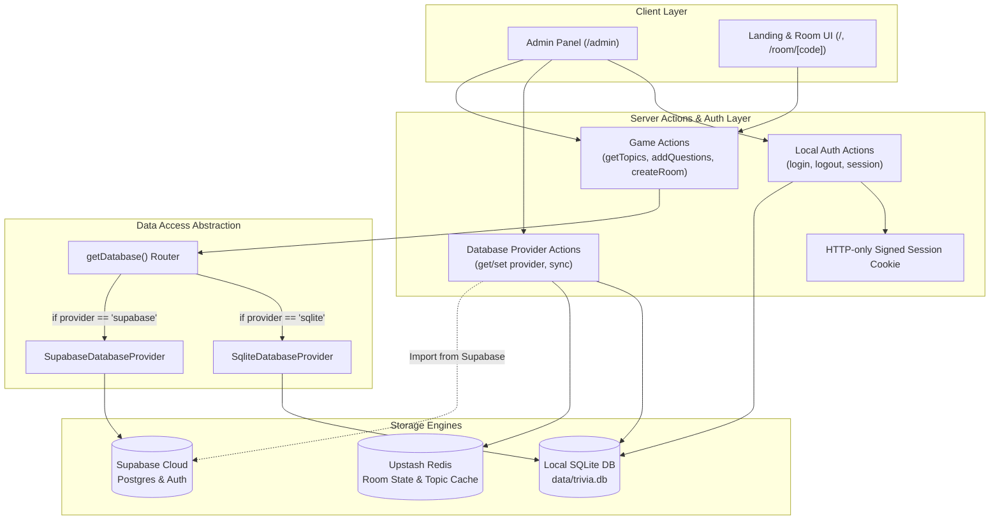

# Design Specification: Local SQLite Database with Supabase Toggle & Local Admin Authentication

- **Date:** 2026-09-03
- **Status:** Approved
- **Topic:** Local SQLite Database, Admin Database Toggle, Local-Only Authentication

---

## 1. Overview & Objectives

TriviaDuel currently utilizes Supabase for persistent data storage (the `topics` and `questions` tables) and for admin authentication via Supabase Auth (`supabase.auth.signInWithPassword()`). Active multiplayer room states, wagers, and scores are managed in Upstash Redis.

This project enhances the system by:
1. Providing a standalone local **SQLite** database as the primary persistence layer for topics, questions, and system settings, using Node.js 22's native `node:sqlite` engine with zero external native compilation dependencies.
2. Providing a **toggle in Admin mode** that dynamically switches the active persistence provider between **Local SQLite** and **Cloud Supabase**.
3. Replacing Supabase Auth with a **Local-Only Authentication System** for administrators, backed by a salted PBKDF2 hash stored in a local SQLite `users` table, accompanied by HMAC-signed HTTP-only session cookies.
4. Supplying an optional **"Import from Supabase"** synchronization tool in Admin mode to transfer cloud topics and questions into local SQLite on demand.

---

## 2. Architecture & Data Flow



---

## 3. Database Architecture & Schema

### 3.1 SQLite Engine
- **Engine**: Node.js 22 built-in `node:sqlite` (`DatabaseSync`).
- **File Location**: `data/trivia.db` (root directory, directory auto-created if missing).
- **PRAGMAs**:
  - `PRAGMA journal_mode = WAL;` (Write-Ahead Logging for high concurrency)
  - `PRAGMA foreign_keys = ON;`

### 3.2 Tables Definition

```sql
-- 1. Topics Table
CREATE TABLE IF NOT EXISTS topics (
    id TEXT PRIMARY KEY,
    name TEXT NOT NULL,
    icon TEXT NOT NULL,
    description TEXT,
    example_question TEXT,
    created_at TEXT DEFAULT (datetime('now')) NOT NULL
);

-- 2. Questions Table
CREATE TABLE IF NOT EXISTS questions (
    id TEXT PRIMARY KEY,
    topic TEXT NOT NULL REFERENCES topics(id) ON DELETE CASCADE,
    summary TEXT NOT NULL,
    text TEXT NOT NULL,
    type TEXT NOT NULL,
    options TEXT, -- JSON-stringified array or null
    correct_answer TEXT NOT NULL,
    explanation TEXT,
    created_at TEXT DEFAULT (datetime('now')) NOT NULL
);

CREATE INDEX IF NOT EXISTS idx_questions_topic ON questions(topic);
CREATE INDEX IF NOT EXISTS idx_questions_text ON questions(text);

-- 3. System Settings Table
CREATE TABLE IF NOT EXISTS system_settings (
    key TEXT PRIMARY KEY,
    value TEXT NOT NULL,
    updated_at TEXT DEFAULT (datetime('now')) NOT NULL
);

-- 4. Local Admin Users Table
CREATE TABLE IF NOT EXISTS users (
    id TEXT PRIMARY KEY,
    email TEXT UNIQUE NOT NULL,
    password_hash TEXT NOT NULL,
    salt TEXT NOT NULL,
    created_at TEXT DEFAULT (datetime('now')) NOT NULL
);
```

### 3.3 Auto-Seeding Protocol
On first access to SQLite:
1. Execute schema initialization statements.
2. If `topics` count is `0`, seed the default topics and questions from `supabase/migrations/0002_data.sql`.
3. If `users` count is `0`, create the default administrator:
   - **Email**: `admin@trivia.local`
   - **Password**: `admin123` (hashed with salt using PBKDF2)
4. If `db_provider` setting is not present in `system_settings`, insert `'sqlite'`.

---

## 4. Provider Abstraction (`DatabaseProvider`)

Defined in `src/lib/db/types.ts`:

```typescript
export interface DatabaseProvider {
  name: 'sqlite' | 'supabase';
  getTopics(): Promise<Topic[]>;
  addTopic(topic: Topic): Promise<void>;
  updateTopic(id: string, updates: Partial<Topic>): Promise<void>;
  deleteTopic(id: string): Promise<void>;
  getQuestionsByTopic(topicId: string): Promise<Question[]>;
  addQuestions(questions: Question[]): Promise<{ count: number; message: string }>;
  updateQuestion(id: string, updates: Partial<Question>): Promise<void>;
  deleteQuestion(id: string): Promise<void>;
  getQuestionsForTopic(topicId: string, count: number): Promise<Question[]>;
}
```

- **`SqliteDatabaseProvider`** (`src/lib/db/sqlite.ts`): Implements the interface using `node:sqlite`. Handles UUID generation for questions without IDs, and parses/stringifies `options` arrays.
- **`SupabaseDatabaseProvider`** (`src/lib/db/supabase.ts`): Implements the interface delegating to `@/lib/supabase/server`.
- **`getDatabase()`** (`src/lib/db/index.ts`): Reads `db_provider` from SQLite `system_settings` (with fallback to `'sqlite'`), and returns the corresponding provider.

---

## 5. Admin Database Toggle & Synchronization

### 5.1 Provider Toggle Operations
- **`getActiveDatabaseProvider()`**: Reads `db_provider` from `system_settings`.
- **`setActiveDatabaseProvider(provider: 'sqlite' | 'supabase')`**:
  - Updates `system_settings` `SET value = ? WHERE key = 'db_provider'`.
  - Deletes `cached_topics` in Redis (`redis.del("cached_topics")`).
  - Returns confirmation.
- **`syncFromSupabaseToSqlite()`**:
  - Authenticates that caller is an admin.
  - Queries all `topics` and `questions` from Supabase.
  - Inserts/upserts them into SQLite (`INSERT OR REPLACE INTO topics...`).
  - Invalidates Redis cache.
  - Returns `{ success: true, topicsCount, questionsCount }`.

### 5.2 UI Implementation
- **Admin Nav Toggle** (`src/components/admin/DatabaseToggle.tsx`):
  - Positioned in the header of `AdminLayout`.
  - Displays a pill switch: `[ ● SQLite (Local) | Supabase (Cloud) ]` with live status indicator.
  - Clicking triggers `setActiveDatabaseProvider`, shows toast feedback, and refreshes state.
- **Dashboard Synchronization Panel** (`src/app/admin/page.tsx`):
  - A card showing current active engine, total local topics count, and total local questions count.
  - An "Import Data from Supabase" button with progress spinner and status report.

---

## 6. Local Authentication System

### 6.1 Cryptographic Standards
- Module: Native `node:crypto`.
- Password Hashing: PBKDF2 with SHA-256:
  - 100,000 iterations.
  - 16-byte random salt generated via `crypto.randomBytes(16)`.
  - 32-byte derived key length.
  - Stored as hex strings.
- Signature Secret: Stored in `system_settings` (`session_secret`) or read from `process.env.ADMIN_SESSION_SECRET`. Auto-generated on first run if absent.

### 6.2 Session Management
- **Cookie**: `trivia_admin_session`
  - Attributes: `httpOnly: true`, `sameSite: 'lax'`, `path: '/'`, `secure: NODE_ENV === 'production'`, `maxAge: 7 * 24 * 3600`.
  - Payload: Base64-encoded `userId:expiresAt:hmacSignature`.
- **Actions** in `src/lib/auth/actions.ts`:
  - `adminLogin({ email, password })`: Validates user in SQLite `users`, verifies password hash, sets session cookie.
  - `adminLogout()`: Clears cookie.
  - `getAdminSession()`: Verifies cookie signature, expiration, and user existence; returns `{ id, email }` or `null`.
  - `changeAdminPassword({ currentPassword, newPassword })`: Updates password hash/salt for current user.

### 6.3 UI Modifications
- `src/app/admin/layout.tsx`: Replaces Supabase Auth client with local `getAdminSession()`, `adminLogin()`, and `adminLogout()`.
- `src/components/admin/AdminLogin.tsx`: Connects to `adminLogin()`, displays validation error messages, and displays default credentials helper (`admin@trivia.local` / `admin123`).
- `src/components/admin/ChangePasswordModal.tsx`: Allows admin to update password at any time.

---

## 7. Edge Cases & Resilience

1. **Supabase Unavailable**: If the admin toggles to Supabase when environment variables are missing or Supabase is down, an error is caught gracefully, an alert toast is shown, and SQLite remains active.
2. **Concurrent Database Writes**: SQLite WAL mode prevents read-write contention.
3. **Cache Coherency**: Switching the active provider immediately deletes `cached_topics` from Redis, ensuring room creation and landing pages reflect the chosen database instantaneously.
4. **Fallback AI Flow**: If a selected topic has 0 questions in either database, the AI generation fallback continues to work seamlessly.

---

## 8. Verification Strategy

1. **Unit Tests**:
   - `tests/db_sqlite.test.ts`: Verify SQLite schema creation, initial data seeding, CRUD for topics and questions, and settings management.
   - `tests/local_auth.test.ts`: Verify PBKDF2 hashing, correct vs incorrect password authentication, cookie signing, and tampering resistance.
2. **Integration & Manual Verification**:
   - Log into `/admin` with `admin@trivia.local` / `admin123`.
   - Toggle between SQLite and Supabase in header; verify persistence.
   - Test "Import from Supabase" sync.
   - Update admin password and verify re-authentication.
